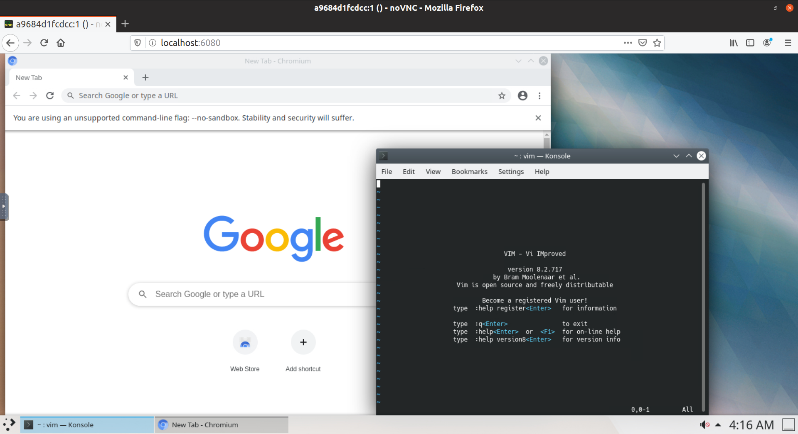

# docker-ubuntu-vnc

[](https://hub.docker.com/r/dcsunset/ubuntu-vnc)
[](https://hub.docker.com/r/dcsunset/ubuntu-vnc)

A docker image of Ubuntu with Xfce desktop and VNC support.

## Screenshots




## Tags

Different tags of this image are based on different versions of ubuntu.

Currently available tags:

* latest: based on ubuntu:lastest
* 18.04: based on ubuntu:18.04
* 16.04: based on ubuntu:16.04

## Usage

Simple usage:

```
docker run -d -p 5900:5900 -p 6080:6080 -e VNC_PASSWD=password dcsunset/ubuntu-vnc
```

Then visit http://localhost:6080 to visit noVNC UI.
Or you can use a different VNC client (like TigerVNC client)
and connect to localhost:5900.

If `VNC_PASSWD` is not set,
then the security type of vncserver is set to None,
it is **insecure** when exposing the container on the Internet.

## Exposed ports

* 5900: Used for VNC interface
* 6080: Used for noVNC Web UI

## Installed applications

To make the image lightweight,
only the following applications are installed by default:

* Xfce desktop
* TigerVNC server
* noVNC
* wget
* Python3
* Vim
* Chromium browser

## Build

To use the latest Ubuntu image:

```
docker build -t ubuntu-vnc .
```

Or specify a version:

```
docker build --build-arg VERSION=18.04 -t ubuntu-vnc .
```

## FAQ

### Fonts

If non-latin characters are not displayed well,
install the font packs based on your needs.

To install the Indian font pack:

```
apt-get install fonts-indic
```

To install the CJK font pack:

```
apt-get install fonts-noto-cjk
```

To install the international font pack:

```
apt-get install fonts-noto
```

### Scaling

By default, noVNC's scaling mode is set to None.
It can be changed in the noVNC panel easily.


# License

MIT License
